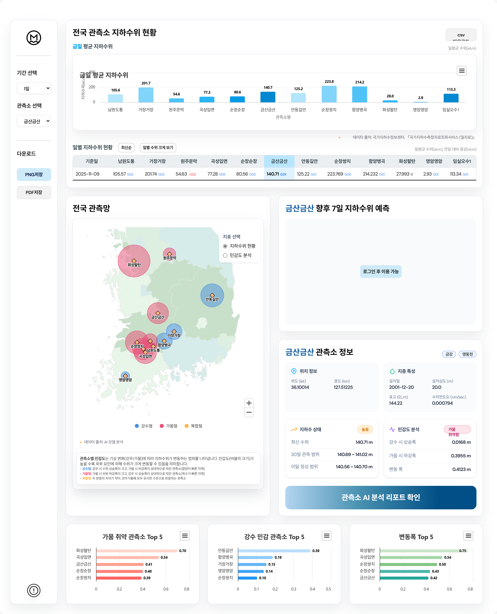

# 물알림단 지하수 예측 대시보드 (Frontend · Next.js)

> 지하수 수위 예측 결과를 시각화하는 **대시보드 Frontend** 레포입니다.  
> Next.js + React 기반으로 지도, 차트, 카드형 위젯 등을 구현했습니다.

---

## 📌 Notes

- 이 레포지토리는 **Frontend** 전용입니다. 백엔드/AI 서버는 별도 레포지토리에서 관리됩니다.
- 일부 실험적인 기능(`src/experiments`, `src/app/monitoring` 등)은 프로덕션 빌드에 포함되지 않으며, 문서에서도 제외했습니다.

---

## 📖 목차 (Table of Contents)

> 목차의 항목을 클릭하면 해당 섹션으로 바로 이동할 수 있습니다.

- [개요](#-개요-overview)
- [시스템 아키텍쳐](#-시스템-아키텍쳐-system-architecture)
- [기술 스택](#-기술-스택-tech-stack)
- [프로젝트 구조](#-프로젝트-구조-project-structure)
- [프리뷰 및 웹 시연 동영상](#-프리뷰-preview)
- [기술적 문제 해결 과정](#-기술적-문제-해결-과정-troubleshooting--key-decisions)
- [향후 개선 로드맵](#-향후-개선-로드맵-roadmap--future-improvements)
- [문서 모음](#-문서-모음-docs)
- [Setup & Run](#-getting-started)
- [Release Notes](#-release-notes)

---

## 🧩 개요 (Overview)
#### 프로젝트 개요
한국과학기술정보연구원(KISTI) 주관 『2025 DATA·AI 분석 경진대회』 과제로 출발한 프로젝트입니다.
기상·수문 데이터를 기반으로 LSTM·Transformer 모델로 지하수위를 예측하고,
예측 결과를 웹 대시보드(Next.js)로 시각화한 End-to-End 서비스입니다.
> AI 기반 지하수위 예측 웹서비스 구축 (End-to-End 프로젝트)<br />
> 기간: 2025.09~2025.11<br />
> 팀 구성: 3명(데이터/백엔드/프론트엔드)<br />
> 역할: 프론트엔드 개발 · 팀장<br />
> 기술: Next.js · Spring Boot · FastAPI · MySQL<br />
> 특징: 외부 기상데이터 API → 모델 예측 API → UI 시각화까지 연결한 End-to-End 흐름 구성

#### 경진대회/성과
- 경진대회명: 2025 DATA·AI 분석 경진대회
- 주관: 한국과학기술정보연구원(KISTI) 주관
- 대회 주제: 지속가능한 수자원 관리를 위한 지하수위 예측 모델 개발
- 2025.10.30 최종 발표 대상팀 선정 및 발표 진행
- 모델 성능: NSE·KGE·RMSE·R² 기반 검증, LSTM 대비 Transformer 결합 모델 성능 향상

#### 역할
> 분리형 3계층 아키텍처에서 **프론트엔드(View + BFF 역할)** 담당
- Next.js 기반 대시보드 UI/UX 설계 및 구현
- 지도/차트/표/모달 등 데이터 시각화 컴포넌트 개발
- **데이터 연동**: Spring Boot · FastAPI 연동 및 데이터 파이프라인 통합 테스트
- Next.js 프록시(rewrites)로 다중 서버 간 CORS·세션 이슈 해결
- REST API 명세서 작성
- **외부 기상 API 연동 및 모델 추론 과정 전체 흐름 설계**  
  → 파이프라인 고도화를 위한 스케줄링·자동화 구조까지 기획 및 시퀀스 정의

#### 주요 기능
  - 전국 관측소 현황: 
    - 전국 관측소 GeoMap + 버블 시각화: 지하수위 현황(경고/위험/정상), 관측소별 기상 민감도(강수민감형·가뭄취약형·복합형) 시각화
    - 전일대비 증감량 표시 테이블
  - 관측소 상세 모달 (관측소별 AI 분석 리포트)
  - 관측소 지하수위 향후 7일 예측 시각화 - FastAPI 연동
  - 대시보드 데이터 Export (CSV, XLSX)
  - 로그인/회원가입/사용자 정보 수정 및 탈퇴

---

### 🏗 시스템 아키텍쳐 (System Architecture)

<p align="center">
  
</p>

---

## 🛠 기술 스택 (Tech Stack)

| 구분 | 기술 | 선택 이유 |
| :--- | :--- | :--- |
| **코어 프레임워크** | [Next.js] (v15) | SEO 최적화와 초기 로딩 속도 개선을 위해 서버 사이드 렌더링(SSR)과 정적 사이트 생성(SSG)을 활용합니다. App Router는 라우팅 및 레이아웃 관리를 위한 강력한 기반을 제공합니다. |
| **UI 라이브러리** | [React] (v19) | 선언적이고 컴포넌트 기반의 접근 방식을 통해 복잡한 사용자 인터페이스를 효율적으로 구축합니다. |
| **언어** | [TypeScript] | JavaScript에 정적 타이핑을 추가하여 코드 품질, 개발자 생산성, 장기적인 유지보수성을 향상시킵니다. |
| **스타일링** | [Tailwind CSS] | 유틸리티 우선 CSS 프레임워크로, HTML을 벗어나지 않고도 빠르고 일관된 UI 개발이 가능합니다. `clsx`와 `tailwind-merge`를 함께 사용하여 조건부 클래스를 깔끔하게 관리합니다. |
| **상태 관리** | [Jotai] | React를 위한 원자적(atomic)이고 유연한 상태 관리 라이브러리입니다. 불필요한 리렌더링을 최소화하고 애플리케이션 전반의 상태 로직을 단순화합니다. |
| **차트 & 지도** | [Highcharts] | Highcharts는 다양한 종류의 인터랙티브 차트를 위해 사용했습니다. |
| **애니메이션** | [Framer Motion], [GSAP] | 부드럽고 복잡한 애니메이션을 구현하여 대시보드의 사용자 경험과 시각적 매력을 향상시킵니다. |
| **데이터 핸들링** | [Papa Parse], [jsPDF], [html-to-image] | Papa Parse는 클라이언트 측 CSV 파싱을 담당합니다. jsPDF와 html-to-image는 데이터 및 시각화 결과(PDF, 이미지 등)를 내보내는 기능을 제공합니다. |
| **린팅 & 포맷팅**| [ESLint] | 일관된 코드 스타일을 강제하고 잠재적 오류를 식별하여 프로젝트 전반의 코드 품질과 유지보수성을 보장합니다. |

---

## 📁 프로젝트 구조 (Project Structure)

```text
c:.
├───public/                     # 정적 에셋 (이미지, 동영상 등)
│   └───assets/
└───src/
    ├───app/                    # 페이지 및 라우팅 (App Router)
    │   ├───api/v1/             # BFF: 백엔드 서버와 통신하는 API Routes
    │   ├───login/              # 로그인 페이지
    │   ├───register/           # 회원가입 페이지
    │   ├───userpage/           # 사용자 정보 페이지
    │   ├───explain/            # 서비스 소개 페이지
    │   ├───privacy/            # 개인정보처리방침
    │   ├───terms/              # 이용약관
    │   ├───layout.tsx          # 공통 레이아웃
    │   └───page.tsx            # 메인 페이지 (랜딩)
    ├───atoms/                  # Jotai 상태 관리
    ├───components/
    │   ├───dashboard/          # 대시보드 관련 컴포넌트 (차트, 맵, 테이블 등)
    │   ├───ui/                 # 공통 UI 컴포넌트 (Header, Footer, Nav 등)
    │   ├───userpage/           # 사용자 페이지 관련 컴포넌트
    │   └───*.tsx               # 그 외 단일 목적 공통 컴포넌트
    ├───data/                   # GeoMap 등에서 사용하는 정적 데이터
    ├───hooks/                  # 커스텀 훅
    ├───lib/                    # API 경로, 유틸리티 함수
    ├───styles/                 # 전역 CSS 스타일
    └───types/                  # 공통 타입 정의
```

---

## 🖼 프리뷰 (Preview)

<p align="center">
  
</p>

---

### 🎥 시연 동영상 (Demo Video)

<a href="https://www.awesomescreenshot.com/video/46379582?key=841a26872d250d5c3c5fcddca08a67d5" target="_blank" rel="noopener noreferrer">
  🔗 https://www.awesomescreenshot.com/video/46379582?key=841a26872d250d5c3c5fcddca08a67d5
</a>


---

## 🤔 기술적 문제 해결 과정 (Troubleshooting & Key Decisions)

이 프로젝트를 진행하며 마주했던 주요 기술적 고민과 해결 과정을 공유합니다.

### 1. 다중서버 CORS 문제: 세션 로그인

- **문제점**: <br/>
  Next.js, Spring Boot, FastAPI가 서로 다른 Origin에서 동작하면서 브라우저가 Cross-Origin으로 판단 → **CORS 에러 발생 + 세션 쿠키 전달 실패(JSESSIONID)**

- **검토한 방법**:
  | 검토한 방법 | 결과 | 비고 |
  |------------|------|------|
  | SameSite=None + Secure + HTTPS | 해결 but 향후 문제발생 가능 | Chrome의 3rd-Party Cookie 정책으로 인증 안정성 부족 |
  | Nginx Reverse Proxy 구성 | 가능 | 운영 환경에 가장 적합하다고 판단되어 이후 **배포 시 작업 예정** |
  | **Next.js `rewrites` 프록시 활용** | 최종 선택 | 개발 환경 즉시 대응 가능 + 구조 단순 |

- **해결 과정**:<br/>
  Next.js rewrites 설정으로 프론트 서버를 중계 서버로 사용하여, 모든 요청 경로가 동일 Origin으로 처리되도록 구성

- **결과**
  - CORS 문제 해결
  - JSESSIONID HttpOnly 쿠키의 경우 프론트 서버의 도메인으로 저장 & 이후 인증 시, 쿠키가 백엔드 서버로 정상적으로 전달


### 2. 로그인 상태 유지 시 초기 UI 깜빡임 문제
- **문제점**:<br/>
  페이지 로딩 시 사용자 인증 상태가 비동기적으로 확인되면서, UI가 잠시 "로그아웃 상태" 이후 "로그인 상태"로 전환되는 깜빡임 발생.

- **검토한 방법**
  | 검토한 방법 | 결과 | 비고 |
  |------------|------|------|
  | LocalStorage 상태 즉시 반영 | 빠르지만 보안 취약 | 값 존재 여부로 UI를 렌더링하면 실제 세션과 상태 불일치 가능성이 있어 보안에 취약 |
  | React Context에 인증 정보 저장 | 부분 해결 | 상태 변경 시 전역 리렌더링으로 비효율 |
  | **Jotai atomWithStorage + 비동기 세션 검증** | 최종 선택 | 상태 관리 단순 + 깜빡임 없는 UI 렌더링 |

- **해결 과정**:
  - **atomWithStorage**로 localStorage에 세션 상태 저장 및 복원
  - **AuthProvider**를 컴포넌트를 통한 세션 동기화: 페이지가 로드되거나 전환될 때마다 세션 검증

- **결과**:
  - 인증 상태 확인 전 UI 깜빡임 현상 제거
  - 로그인 상태가 CSR 환경에서도 부드럽게 유지됨
  - 인증/비인증 상태에 따른 조건부 렌더링 및 페이지 보호 로직 단순화

---

## 🚀 향후 개선 로드맵 (Roadmap & Future Improvements)

아래 기능과 구조 개선은 **v2.0.0 Release**에서 적용될 예정이며,  
운영 환경에서 안정성과 데이터 흐름의 일관성을 확보하는 것을 목표로 합니다.


### 1️⃣ 운영 아키텍처 전환 (Architecture Refactoring)

현재 개발 환경에서는 Next.js가 Proxy 역할을 수행하고 있으나,  
운영 단계에서는 다음과 같은 구성으로 전환합니다:

```text
Client → Nginx → Spring Boot(API Gateway) → FastAPI / MySQL / Next.js
```

- **Spring Boot를 API Gateway로 승격**
- 인증·인가, CORS, Rate-Limit, 요청 로깅을 **중앙 집중화**
- Next.js는 UI/Presentation 전담
- FastAPI는 **AI 추론 전담 서비스**로 고립
- 서비스 간 통신은 REST 기반(추후 gRPC 고려)

**기대 효과 (Expected Benefits)**

| 항목 | 개선 효과 |
|------|-----------|
| 보안 | 쿠키·세션 관리 단일화, SameSite 정책 충돌 방지 |
| 유지보수성 | 책임 분리 → 프론트/UI와 백엔드/로직 독립 |
| 확장성 | 서버 추가 및 로드밸런싱 구조로 확장 가능 |


### 2️⃣ End-to-End 데이터 파이프라인 구축

현재 데이터 흐름은 단방향 fetch 중심이지만,  
운영 단계에서는 **자동 수집 → 저장 → 추론 → 제공** 흐름을 정식 파이프라인화합니다.

```text
(1) Open API → (2) Spring Boot → (3) MySQL 저장
↓
(4) FastAPI → (5) AI 예측 → (6) 결과 저장(MySQL)
↓
(7) Next.js → 실시간 대시보드 제공
```

- Spring Boot → 웹 크론(Web Cron) 기반 실시간 수집
- FastAPI → 모델 실행 및 예측 결과 저장
- Next.js → 저장된 데이터를 읽기만 하는 구조로 변경

**기대 효과 (Expected Benefits)**

| 항목 | 효과 |
|------|------|
| 데이터 신뢰성 | API 장애가 있어도 DB 기반 업데이트 가능 |
| 응답 속도 | Next.js가 ‘직접 모델 호출’이 아닌 ‘데이터 조회’로 변경 → 성능 개선 |
| 재현성 | 동일 데이터 기준으로 모델 재실행·검증 가능 |


### 3️⃣ 운영 안정성 (Observability)

- Nginx + HTTPS + 도메인 통합
- 장애 시 fallback 전략 추가


> v2.0.0은 단순 기능 추가가 아닌, "개발 환경 → 운영 서비스"로의 전환을 목표로 합니다.

---

## 📚 문서 모음 (Docs)

> *문서들은 프로젝트 진행 및 개선에 따라 업데이트됩니다.*

[](./docs/project-report-v1.docx)
[](./docs/presentation/presentation.pdf)

---

## 🚀 Getting Started

```bash
# 1. 의존성 설치
npm install

# 2. 개발 서버 실행
npm run dev

# 3. 브라우저에서 열기
http://localhost:3000
```

---

## 🔐 환경변수 설정 (Environment Variables)

#### .env.local

`.env.local` 파일을 프로젝트 루트에 생성하고 아래 환경변수를 설정해야 합니다.

```text
# Open API 서버와 통신하기 위한 키
GROUNDWATER_API_KEY=
```

---

## 📝 Release Notes

| 버전 | 날짜 | 주요 변경 내용 |
|-------|------|----------------|
| v1.0.0 | 2025-11-09 | 로컬 통합 |
| v2.0.0 | 예정 | 운영 환경 아키텍처 확립 + End-to-End 파이프라인 구축 |
